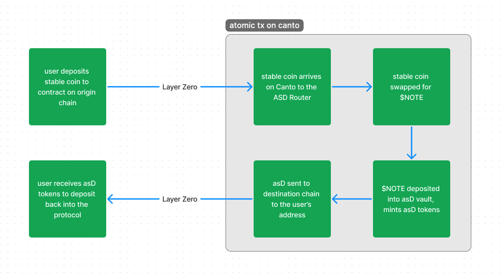

# Application Specific Dollar Omnichain Fungible Token (asD-OFT)

## Background

asD allows for protocols to earn yield on their users' dollar deposits. asD is always pegged to 1 $NOTE and this $NOTE can be deposited into the Canto Lending Market to accrue interest. This version of asD implements LayerZero's Omnichain Fungible Token to allow creators from any LayerZero supported chain to earn extra revenue from all stable coin deposits.

#### Useful background information

- NOTE: https://docs.canto.io/overview/canto-unit-of-account-usdnote
- Canto Lending Market: https://docs.canto.io/overview/canto-lending-market-clm
- Compound cTOKEN Documentation: https://docs.compound.finance/v2/ctokens
- Layer Zero: https://docs.layerzero.network/contracts/overview
- asD ERC20 c4 audit: https://code4rena.com/audits/2023-11-canto-application-specific-dollars-and-bonding-curves-for-1155s

## asD Flow

The purpose of implementing cross chain functionality with asD is to allow developers from any supported chain to earn Canto Lending Market yield without needing to directly deploy their entire protocol on the Canto application layer. By using Layer Zero v2, we can accomplish this by bridging whitelisted stable coins to mint asD tokens that can then be bridged back to the original application.



## Contracts

### ASDOFT

The ASDOFT contract is a direct implementation of the ASD ERC20 token used for [1155Tech](https://github.com/code-423n4/2023-11-canto) however it also implements LayerZero v2 OFT functionality. This allows for asD tokens minted on Canto as well as easily bridged back to the source application to be used in the protocol.

In order to ensure a 1:1 peg to $NOTE, only the ASDOFT should be deployed on Canto for minting, and regular OFT implementations should be deployed on all other supported chains.

### ASDRouter

The ASDRouter contract allows for the minting of asD tokens to be done in a single transaction originating from any supported chain. A stable coin represented as an OFT is sent to the ASDRouter with "lzCompose" options passed to tell the Layer Zero executor to call `lzCompose` once it receives the message.

```javascript
 function lzCompose(
    address _from,
    bytes32 _guid,
    bytes calldata _message,
    address _executor,
    bytes calldata _extraData) external payable;
```

A user who wants to obtain asD tokens must send their stable assets to the ASDRouter through Layer Zero. The `_message` must be formatted as bytes with the form of the OFTComposeMessage struct:

```javascript
struct OftComposeMessage {
    uint32 _dstLzEid; // destination endpoint id
    address _dstReceiver; // receiver on destination
    address _dstAsdAddress; // asD address on destination
    address _cantoAsdAddress; // asD on Canto (where to mint asD from)
    uint256 _minAmountASD; // minimum amount (slippage for swap)
    address _cantoRefundAddress; // canto refund address
    uint256 _feeForSend; // fee for bridge to destination chain
}
```

This struct tells the Router which asD tokens to mint and where to send them after they are obtained. The `lzCompose` function on the Router performs the following steps

1. Deposits stable coin for asdUSDC
2. Swaps asdUSDC in ambient pool for $NOTE
3. Deposits $NOTE to asD Vault for asD tokens
4. Sends asD tokens to destination chain and address

After lzCompose has been called, the Router should never have any tokens left over (all tokens are refunded or sent). With Layer Zero execution, if the `lzCompose` reverts, the OFT tokens are still received by the Router, but the compose message can be retried. Because of this, the Router protects against reverts by implementing saftey checks and refunds during each step. All refunds will be sent to the user's address on Canto. For any message that contains `msg.value`, the entire amount will also be refunded to the user as Canto.

Saftey checks:

1. Incorrect compose message formatting (OFT refunded)
2. Not whitelisted stable coin version (OFT refunded)
3. Unsuccessful swap to $NOTE (usdcOFT refunded)
4. Unsuccessful deposit into asD vault ($NOTE refunded)
5. Unsuccessful bridge of asD to destination of insufficient fee (asD refunded)

### ASDUSDC

ASDUSDC is a simple wrapper for all of the different representations for the same stable coins that might be bridged through Layer Zero. The purpose of this is to limit the amount of pools needed for swapping tokens to $NOTE. With this wrapper, only one pool is needed and all OFT's representing the same can be wrapped into ASDUSDC and swapped for Note easily. A user can deposit any of the whitelisted usdc versions to mint ASDUSDC as well as withdraw any of those same versions (as long as there is enough locked) by burning their ASDUSDC.

## Build & Test
Clone this repo and run the following code to build all of the contracts and run the test suite. 
```bash
npm install
npx hardhat compile
npx hardhat test
```
